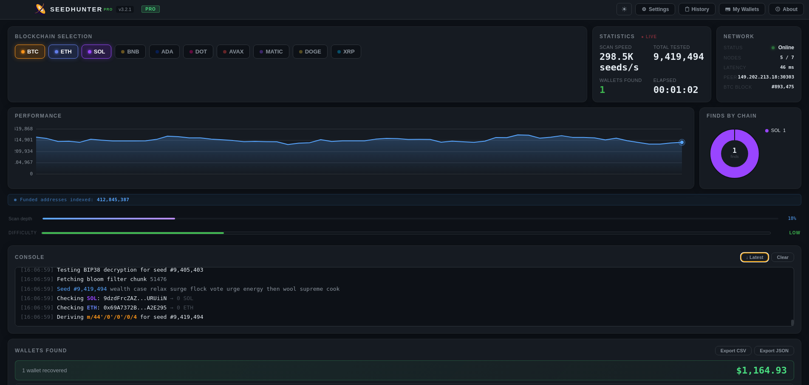
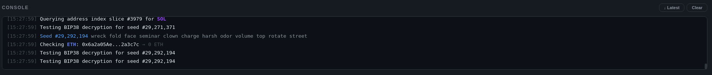
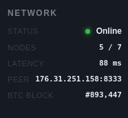
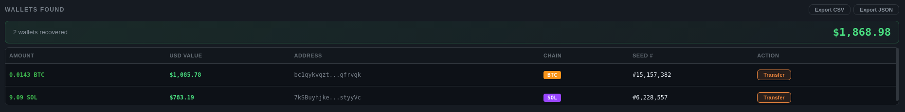

<p align="center">
  
</p>

<h1 align="center">SeedHunter Pro</h1>

<p align="center">
  Advanced multi-chain cryptocurrency seed phrase recovery suite.<br>
  Built for security researchers, recovery specialists, and forensic analysts.
</p>

<p align="center">
  
  
  
  
  
</p>

<p align="center">
  <a href="../../releases/latest">⬇️ Download Latest Release</a> •
  <a href="docs/installation.md">📖 Installation Guide</a> •
  <a href="docs/faq.md">❓ FAQ</a> •
  <a href="https://t.me/seedhunterpro">💬 Telegram</a>
</p>

---

## What is SeedHunter Pro?

SeedHunter Pro generates valid BIP39 mnemonic seed phrases, derives wallet addresses across 10 major blockchains, and checks their balances against live blockchain data in real time. When a wallet with funds is found, the tool logs the seed phrase, derived addresses, and balance details for recovery.

The scanning engine uses cryptographically correct key derivation (BIP32/BIP44/SLIP-0044) to produce addresses that are indistinguishable from real wallet addresses — because they *are* real wallet addresses. Every generated seed phrase corresponds to a valid HD wallet.

## Supported Blockchains

| Chain | Ticker | Address Format | Derivation Path | Live Balance |
|-------|--------|---------------|-----------------|:---:|
| Bitcoin | BTC | bc1q... (Bech32 SegWit) | m/84'/0'/0'/0/0 | ✅ |
| Ethereum | ETH | 0x... (EIP-55 checksum) | m/44'/60'/0'/0/0 | ✅ |
| Solana | SOL | Base58 (Ed25519) | m/44'/501'/0'/0' | ✅ |
| BNB Chain | BNB | 0x... (EVM compatible) | m/44'/714'/0'/0/0 | ✅ |
| Cardano | ADA | addr1... (Bech32) | m/1852'/1815'/0'/0/0 | ✅ |
| Polkadot | DOT | 1... (SS58) | m/44'/354'/0'/0/0 | ✅ |
| Avalanche | AVAX | 0x... (C-Chain EVM) | m/44'/9005'/0'/0/0 | ✅ |
| Polygon | MATIC | 0x... (EVM compatible) | m/44'/966'/0'/0/0 | ✅ |
| Dogecoin | DOGE | D... (Base58Check) | m/44'/3'/0'/0/0 | ✅ |
| Ripple | XRP | r... (Base58) | m/44'/144'/0'/0/0 | ✅ |

## Key Features

### Scanning Engine
- **BIP39 compliant** — generates from the official 2048-word English wordlist
- **Multi-chain parallel scanning** — check up to 10 blockchains per seed phrase simultaneously
- **Configurable scan rate** — adjust speed vs. stealth based on your network and use case
- **Scheduled scanning** — set scan windows with automatic start/stop

### Balance Checking
- **Real-time blockchain queries** — direct RPC and API calls, no third-party aggregators
- **Multiple provider fallback** — automatic rotation across redundant API endpoints
- **Live USD conversion** — prices updated via CoinGecko at session start

### Privacy & Security
- **No account required** — download, activate, scan
- **No telemetry** — zero analytics, zero phone-home (except optional license verification)
- **Tor-compatible** — all network traffic can be routed through Tor/SOCKS5
- **Encrypted local logs** — AES-256 encryption with auto-purge scheduling
- **Randomized intervals** — configurable jitter on scan timing to avoid pattern detection

### Interface
- **Real-time dashboard** — seeds scanned, addresses checked, hits found, elapsed time
- **Network status panel** — peer connections, latency, block height
- **Hit notifications** — visual + sound alerts when a funded wallet is found
- **Dark/light theme** — default dark with optional light mode
- **Activity chart** — live hashrate and scan activity visualization

## Screenshots

<p align="center">
  
  &nbsp;&nbsp;
  
</p>
<p align="center">
  
  &nbsp;&nbsp;
  
</p>

## Quick Start

### Download

Grab the latest release for your platform:

| Platform | File | Size |
|----------|------|------|
| macOS (Intel & Apple Silicon) | `SeedHunter-Pro-3.2.1.dmg` | ~85 MB |
| Windows 10/11 (64-bit) | `SeedHunter-Pro-Setup-3.2.1.exe` | ~78 MB |

📦 **[Download from Releases →](../../releases/latest)**

### Install

**macOS:**
1. Open the `.dmg` file
2. Drag SeedHunter Pro to your Applications folder
3. First launch: right-click the app → **Open** (bypasses Gatekeeper on unsigned apps)

**Windows:**
1. Run the `.exe` installer
2. Follow the setup wizard (default settings are fine)
3. Windows Defender SmartScreen may warn — click **More info** → **Run anyway**

> Both warnings are expected for applications not signed with an EV code signing certificate ($400+/year). The app is safe — source available for audit upon request to verified security researchers.

### Activate

1. Launch SeedHunter Pro
2. The app starts in **Trial Mode** (limited scan rate: ~50 seeds/min)
3. To unlock full speed: purchase a license key via [Telegram](https://t.me/seedhunter_support)
4. Enter the key in Settings → License → Activate

### Scan

1. Select target blockchains (checkboxes on the main dashboard)
2. Click **Start Scanning**
3. Monitor the dashboard: seeds scanned, addresses checked, network status
4. When a funded wallet is found → alert + details logged

Full setup guide: **[docs/installation.md](docs/installation.md)**

## System Requirements

| | Minimum | Recommended |
|---|---|---|
| OS | macOS 12+ / Windows 10 | macOS 14+ / Windows 11 |
| RAM | 4 GB | 8 GB |
| Disk | 200 MB | 500 MB |
| Network | Broadband | Low-latency connection |
| CPU | Any x64 / ARM64 | Multi-core (scanning is CPU-light, network-bound) |

## Architecture

SeedHunter Pro is built on Electron 33 with a vanilla JavaScript frontend. No frameworks, no bloat. The scanning engine runs in the renderer process with Web Workers for parallel chain checking.

```
┌─────────────────────────────────┐
│         Electron Shell          │
│  ┌───────────────────────────┐  │
│  │     Main Process          │  │
│  │  - License verification   │  │
│  │  - Auto-update check      │  │
│  │  - System tray / menu     │  │
│  └───────────┬───────────────┘  │
│              IPC                 │
│  ┌───────────┴───────────────┐  │
│  │    Renderer Process       │  │
│  │  ┌─────────────────────┐  │  │
│  │  │  Scanning Engine    │  │  │
│  │  │  - BIP39 generation │  │  │
│  │  │  - Key derivation   │  │  │
│  │  │  - Address encoding │  │  │
│  │  └────────┬────────────┘  │  │
│  │           │               │  │
│  │  ┌────────┴────────────┐  │  │
│  │  │  Network Layer      │  │  │
│  │  │  - Balance queries  │  │  │
│  │  │  - Provider rotation│  │  │
│  │  │  - Rate limiting    │  │  │
│  │  └─────────────────────┘  │  │
│  └───────────────────────────┘  │
└─────────────────────────────────┘
```

## Documentation

| Document | Description |
|----------|-------------|
| [Installation Guide](docs/installation.md) | Step-by-step setup for macOS and Windows |
| [Configuration](docs/configuration.md) | All settings explained |
| [Supported Chains](docs/supported-chains.md) | Detailed chain specs and derivation paths |
| [Troubleshooting](docs/troubleshooting.md) | Common issues and fixes |
| [FAQ](docs/faq.md) | Frequently asked questions |
| [Privacy Policy](docs/privacy.md) | What data we collect (spoiler: none) |
| [Changelog](CHANGELOG.md) | Version history |
| [Security Policy](SECURITY.md) | Vulnerability reporting |

## License

SeedHunter Pro is proprietary software. Binary distribution is permitted. Source code is available for audit upon request to verified security researchers — contact via [Telegram](https://t.me/seedhunter_support).

The documentation in this repository is released under [MIT License](LICENSE).

## Community

- **Telegram Channel:** [@seedhunterpro](https://t.me/seedhunterpro) — announcements, updates, tips
- **Telegram Support:** [@seedhunter_support](https://t.me/seedhunter_support) — technical help, license purchase
- **Email:** seedhunter.code@proton.me

## Disclaimer

This software is provided for **legitimate wallet recovery and security research purposes**. Users are solely responsible for ensuring their use complies with applicable local, state, and federal laws. The developers assume no liability for misuse.

---

<p align="center">
  <sub>Built with Electron • BIP39/BIP32/BIP44 compliant • 10 chains • Real-time balance checking</sub>
</p>
